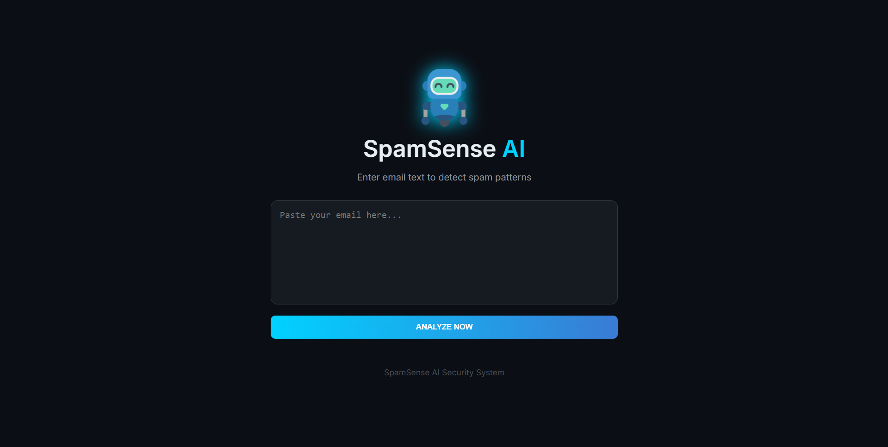
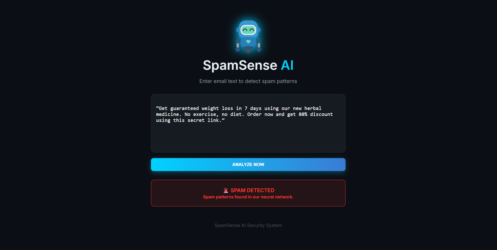

📧 Spam Detection Web App Using ANN & Flask

A real-time Email/SMS Spam Detection Web Application built with HTML, CSS, JavaScript (frontend) and Flask API (backend).
It uses an Artificial Neural Network (ANN) trained with MLPClassifier to classify messages as Spam or Ham (Not Spam) with ~98% accuracy.

🌐 Live Demo
[View Live](https://spamsense-email-spam-detection-system.onrender.com/)

🎯 Objective

Detect spam messages in real-time

Apply text preprocessing & feature extraction

Train an ANN model (MLPClassifier)

Provide a web interface for user interaction

Achieve high classification accuracy

🧠 Machine Learning Approach

Algorithm: Artificial Neural Network (ANN)

Model: MLPClassifier (scikit-learn)

Type: Supervised Learning (Binary Classification)

Trained with: SMS/Email text dataset

🛠️ Technologies Used

Frontend: HTML, CSS, JavaScript

Backend/API: Python, Flask

Machine Learning: scikit-learn, NumPy, Pandas, NLTK

Visualization: Matplotlib, Seaborn

📂 Dataset

Type: SMS/Email text

Classes: Spam, Ham

Features: Message text

Target: Spam or Not Spam

⚙️ Workflow

User inputs a message in the web interface

Flask API receives the message

Text preprocessing:

Lowercasing

Removing punctuation & stopwords

Tokenization

Feature Extraction: TF-IDF Vectorization

ANN (MLPClassifier) predicts Spam or Ham

Result displayed on the frontend

🧪 Model Configuration
MLPClassifier(
    hidden_layer_sizes=(100, 100),
    max_iter=1000,
    activation='tanh',
    solver='sgd',
    learning_rate_init=0.001,
    learning_rate='constant',
    random_state=42
)

📊 Results

Training Accuracy: ~99%

Testing Accuracy: ~98%

Confusion Matrix:

[[962   3]
 [ 21 129]]

Classification Report:

Precision  Recall  F1-Score
0  0.98   1.00   0.99
1  0.98   0.86   0.91

📸 Screenshots
Web Interface:

Detection Result:

▶️ How to Run the Project

Clone the repository

Install dependencies:

pip install flask numpy pandas scikit-learn nltk matplotlib seaborn

Run Flask backend:

python app.py

Open index.html in a browser

Input a message and click Detect Spam

📌 Key Features

Real-time spam detection via web interface

High accuracy ANN-based classification

Clean and responsive frontend

Scalable Flask API backend

Production-ready and easy to extend

🔮 Future Improvements

Upgrade to Deep Learning (LSTM / BERT)

Deploy on cloud hosting (Heroku, Render, Vercel)

Enhance dataset size and diversity

Add user authentication & history tracking

👨‍💻 Author

Sumit Kumar
BCA Student | MERN Stack & ML Enthusiast

GitHub: https://github.com/sumitkumar044

LinkedIn: https://www.linkedin.com/in/sumit-kumar-47b0a5351/
